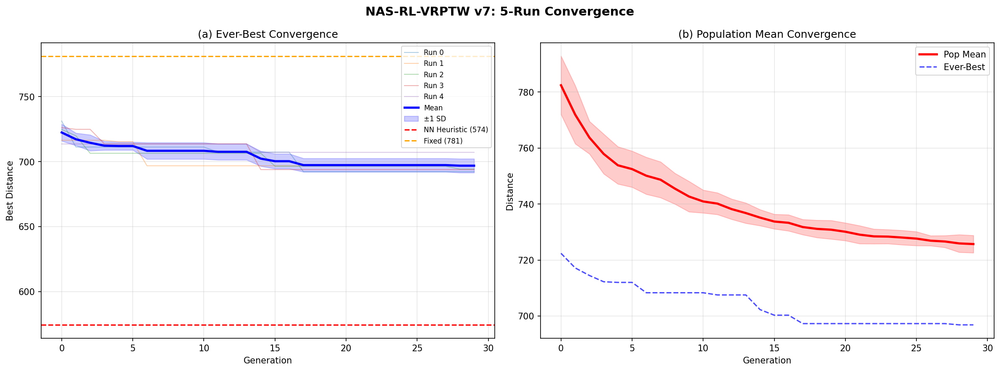

# NAS-RL-VRPTW: Neural Architecture Search for DQN-Based Vehicle Routing with Time Windows
 
[](https://www.python.org/)
[](https://pytorch.org/)
[](https://colab.research.google.com/)
[](LICENSE)
 
> **CDS526: Artificial Intelligence-based Optimization — Case Study**  
> Lingnan University, Hong Kong · April 2026
 
An end-to-end pipeline that uses an **Evolutionary Algorithm (EA)** to search for optimal **Deep Q-Network (DQN)** architectures for solving the **Vehicle Routing Problem with Time Windows (VRPTW)**. Combines three AI-based optimization topics: Neural Architecture Search (NAS), Evolutionary Reinforcement Learning (ERL), and Vehicle Routing Problems (VRP).
 
---
 
## Key Results
 
| Method | Mean Distance | Best Distance | p-value vs NAS-EA |
|---|---|---|---|
| NN Heuristic | 574.4 ± 136.3 | 316.3 | — |
| Fixed 3×128 ReLU | 781.2 | 781.2 | 0.0037 |
| Random Search (20) | 784.4 ± 53.4 | 710.9 | < 0.0001 |
| **NAS-EA v7 (5 runs)** | **696.8 ± 5.4** | **692.2** | — |
 
**Best architecture found:** 5-layer [32, 32, 128, 32, 128] with Tanh activation, self-attention, lr=1e-4, 25,269 parameters.
 
NAS-EA significantly outperforms random architecture search (Mann-Whitney U, p < 0.0001) and fixed architecture (p = 0.0037) with **zero constraint violations** across all 5 runs.
 
<p align="center">
  
</p>
 
---
 
## Project Structure
 
```
NAS-RL-VRPTW/
├── NAS_RL_VRPTW_v7_CDS526.ipynb   # Main notebook (all code)
├── README.md                       # This file
├── results/                        # Experimental outputs
│   ├── results_*.json              # Per-run EA results (5 runs)
│   ├── v7_comparison.json          # Baseline comparison + statistical tests
│   ├── multi_run_convergence.png   # 5-run convergence plot
│   ├── instances.png               # Instance type visualization
│   ├── retrain.png                 # Retrain budget analysis
│   ├── solomon_generalization.png  # Solomon C101 generalization test
│   └── solomon_subset_viz.png      # Solomon subset visualization
├── report/
│   └── final.pdf                   # IEEE-format final report
└── presentation/
    └── presentation.pptx           # Slide deck (8-12 slides)
```
 
---
 
## How to Run
 
### Prerequisites
 
- Google Colab with **GPU runtime** (A100 recommended, T4 works but slower)
- Google Drive for checkpoint storage
- ~16 hours total for 5 full EA runs on A100
 
### Step-by-Step
 
1. **Open the notebook** in Google Colab:
   ```
   Upload NAS_RL_VRPTW_v7_CDS526.ipynb to Colab
   Runtime → Change runtime type → GPU (A100 if available)
   ```
 
2. **Run cells in order:**
 
   | Cell | Name | What It Does | Runtime |
   |---|---|---|---|
   | 1 | Install Dependencies | Installs PyTorch, Gymnasium, SciPy, Matplotlib | ~30s |
   | 2 | Mount Google Drive | Mounts Drive for checkpoint persistence | ~5s |
   | 3 | Pipeline Definition | Loads all class definitions (config, env, DQN, EA) | ~1s |
   | 4 | Run / Resume Evolution | Runs 5 independent EA runs (30 gens × 20 pop × 300 ep) | **~16h** |
   | 5 | Visualize Instances | Plots clustered/random/mixed instance samples | ~5s |
   | 6 | Monitor | Shows current checkpoint status | ~2s |
   | 7 | Visualize Results | 6-panel convergence dashboard | ~5s |
   | 8 | Baselines + Statistics | Runs NN heuristic, fixed arch, random search + Mann-Whitney U tests | ~30min |
   | 9 | Multi-Run Convergence | Plots 5-run convergence with mean ± SD | ~5s |
   | 10 | Retrain Best Architecture | Retrains best arch at 300/1500/3000 episodes × 3 trials | ~40min |
   | 11 | Solomon Benchmark | Downloads C101, creates 20-customer subsets, tests generalization | ~50min |
 
3. **Crash recovery:** Cell 4 auto-resumes from checkpoints. If Colab disconnects, just rerun Cells 1→2→3→4. Completed runs are skipped automatically.
 
4. **Results** are saved to Google Drive at:
   ```
   /content/drive/MyDrive/CDS526_NAS_RL_VRPTW_v7/
   ├── run_0/ through run_4/     # Per-run checkpoints + results
   │   ├── checkpoints/          # Pickle checkpoints (every generation)
   │   ├── results/              # JSON results
   │   └── logs/                 # Run logs
   ├── results/                  # Comparison JSON, plots
   └── solomon/                  # Downloaded Solomon C101 data
   ```
 
---
 
## Pipeline Architecture
 
```
┌─────────────────────────────────────────────────┐
│            Evolutionary Algorithm (EA)            │
│  Population: 20 architectures × 30 generations   │
│                                                   │
│  ┌─────────────┐  ┌──────────────┐  ┌─────────┐ │
│  │  Stochastic  │  │   Fitness    │  │  Determ  │ │
│  │   Ranking    │  │   Sharing    │  │ Crowding │ │
│  └──────┬──────┘  └──────┬───────┘  └────┬────┘ │
│         └────────────┬───┘               │       │
│                      ▼                   │       │
│         ┌────────────────────┐           │       │
│         │  Adaptive Operator  │           │       │
│         │  Selection (AOS)    │◄──────────┘       │
│         │  4 operators + rewards                  │
│         └─────────┬──────────┘                    │
│                   ▼                               │
│    ┌──────────────────────────────┐               │
│    │   For each architecture:     │               │
│    │   ┌────────────────────────┐ │               │
│    │   │   DQN Training (RL)    │ │               │
│    │   │   300 episodes         │ │               │
│    │   │   Action-masked ε-greedy│ │               │
│    │   │   Experience replay     │ │               │
│    │   └───────────┬────────────┘ │               │
│    │               ▼              │               │
│    │   ┌────────────────────────┐ │               │
│    │   │  VRPTW Environment     │ │               │
│    │   │  Gymnasium-compliant   │ │               │
│    │   │  Action masking (TW +  │ │               │
│    │   │  capacity + visited)   │ │               │
│    │   └────────────────────────┘ │               │
│    │   Fitness = mean distance    │               │
│    └──────────────────────────────┘               │
└─────────────────────────────────────────────────┘
```
 
---
 
## NAS Search Space
 
| Hyperparameter | Search Range | Cardinality |
|---|---|---|
| Number of layers | {2, 3, 4, 5, 6} | 5 |
| Hidden dim per layer | {32, 64, 128, 256} | 4^L |
| Activation function | {ReLU, Tanh, ELU, GELU} | 4 |
| Self-attention | {True, False} | 2 |
| Learning rate | {1e-4, 3e-4, 5e-4, 1e-3} | 4 |
| Dropout rate | {0.0, 0.1, 0.2} | 3 |
 
Total: ~1.57 million possible architectures.
 
---
 
## EA Techniques Used
 
| Technique | Purpose | Reference |
|---|---|---|
| **Stochastic Ranking** | Balance feasibility vs. objective (pf=0.45) | Runarsson & Yao, 2000 |
| **Fitness Sharing** | Maintain architecture diversity (σ=0.3) | Goldberg & Richardson, 1987 |
| **Deterministic Crowding** | Niching — offspring replaces nearest parent | Mahfoud, 1995 |
| **Adaptive Operator Selection** | Reward-proportional operator probabilities | Pei et al., 2024 |
| **Elitism** | Preserve top-2 across generations | — |
| **Tournament Selection** | Parent selection with shared fitness (k=3) | — |
 
---
 
## Dependencies
 
```
torch >= 2.0
gymnasium >= 0.29
scipy >= 1.10
matplotlib >= 3.7
numpy >= 1.24
```
 
All dependencies are installed automatically by Cell 1 of the notebook.
 
---
 
## Reproducibility
 
All experiments are fully reproducible:
 
- **Global seeds:** {42, 1042, 2042, 3042, 4042} for the 5 independent runs
- **Instance seeds:** Deterministic via `np.random.RandomState(seed)`
- **RNG state:** Python, NumPy, and PyTorch RNG states saved/restored in every checkpoint
- **Config hashing:** Checkpoints are validated against config hash to prevent loading incompatible states
 
---
 
## Known Limitations
 
1. **NN heuristic beats RL:** The greedy nearest-neighbour heuristic (574) outperforms the best NAS-found DQN (692), indicating the RL training budget and reward design are the primary bottlenecks.
2. **Small scale:** 20 customers; observation space is O(n), limiting scalability.
3. **Distribution-specific:** Architecture found on synthetic GMM instances does not generalize to Solomon C101.
4. **Epsilon schedule:** With decay=400, the agent is ~50% random at episode 300.
 
---
 
## References
 
1. M. Desrochers, J. Desrosiers, M. Solomon, "A new optimization algorithm for the VRPTW," *Operations Research*, 1992.
2. T. Elsken, J. H. Metzen, F. Hutter, "Neural architecture search: A survey," *JMLR*, 2019.
3. T. P. Runarsson, X. Yao, "Stochastic ranking for constrained evolutionary optimization," *IEEE Trans. Evol. Comput.*, 2000.
4. X. Yao, "Evolving artificial neural networks," *Proc. IEEE*, 1999.
5. T. Salimans et al., "Evolution strategies as a scalable alternative to reinforcement learning," *arXiv:1703.03864*, 2017.
6. M. M. Solomon, "Algorithms for the vehicle routing and scheduling problems with time window constraints," *Operations Research*, 1987.
7. C. Hu, J. Pei, J. Liu, X. Yao, "Evolving constrained reinforcement learning policy," *Proc. IJCNN*, 2023.
8. J. Pei, Y. Mei, J. Liu, M. Zhang, X. Yao, "Adaptive operator selection for metaheuristics: A survey," *IEEE Trans. AI*, 2025.
 
---
 
## License
 
This project is developed for academic coursework (CDS526, Lingnan University). Code is provided for educational purposes.
